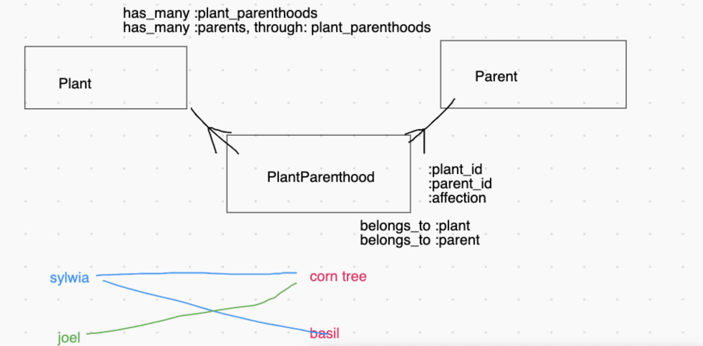

Active Record Relationships
===

## SWBATs
- [ ] Build on the knowledge of OO Ruby associations to use them in AR
- [ ] Draw a three-model ERD prior to coding
- [ ] Design domain model thoughtfully
- [ ] Remember that it is the joiner's responsibility to know about the other `id`'s
- [ ] Become comfortable with the syntax of the association macros (`belongs_to`, `has_many`, `has_many through`) 
- [ ] Understand that macros give us methods but the associations happen in the database

### Outline
* Review what we covered so far:
    - What is AR?
      - translator between sql and ruby -> sql is based on tables and ruby is OO; sql does not know about some datatypes
      - design pattern
      - gem
    - What does AR do?
      - translates between sql and ruby
    - When to use SQL and when AR?
      - in this program: always AR; outside: it's up to you
    - What's the difference between a model and a table?
      - model -> classes; Ruby instances (local memory); models hold behaviors
      - table -> created via migration; rows and columns; database records (persists in the database) -> we persist them by running AR methods (e.g. .save, .create, .update); hold attributes
    - Can a database have many tables?
      - YES! As many as you **need**
    - What is meant by migration?
      - migration is a blueprint for ActiveRecord to create/change/delete SQL tables
    - Naming conventions in Ruby and AR
      - model name:  singular
      - everything else: PLURAL
    - What is `rake`?
      - task manager
      - your personal toolbox
      - gem
    - What is `rake console`?
      - SUPERPRY
      - a pry session that can access our whole app, incl. the database
    - Difference between `.new` and `.create`
      - `.new` -> just creates a Ruby instance (which you may SAVE to the databse)
      - `.create` -> new+save
    - What is CRUD and what are the examples of methods for each letter?
      - CRUD -> create, read, update, delete
      - create: .create
      - read: 
          - .all
          - .find(id) / .find_by(attribute: value)
      - update: .update
      - delete: .destroy

### Setting up relationships

This is our domain model we'll start with:

```
Plant —————< PlantParenthood >————————— Parent
:species       :affection (int)         :name
:color                                  :resposible
:bought(datetime)                       :age
:fussy(bool)
```

This is the erd I drew in the lecture:


- How can we associate a Parent with a Plant and vice-versa?

Let's first create the association between Parent and PlantParenthood. **Since It's the PlantParenthood that has the chicken feet on itself, this is the model that should contain the instance ides of others.**

```ruby
class PlantParenthood < ActiveRecord::Base
  def parents
    # Parent.all.find{ |parent| parent.id == self.parent_id }
    # OR use AR .find
    Parent.find(self.parent_id )
  end
end
#...
class Parent < ActiveRecord::Base
  def plant_parenthoods
    # PlantParenthood.all.select{|pp| pp.parent_id == self.id}
    # OR use AR .where
    PlantParenthood.where(parent_id: self.id)
  end
end
```

## What About a Better Way™️

- ActiveRecord Macros
  - PlantParenthood model: `belongs_to :plant`, `belongs_to :parent`
  - Plant model `has_many :plant_parenthoods`
  - Parent model `has_many :parents`
- These macros provide **even more** methods, like `plant_instance.parents` and `parent_instance.plants`
  - **Major Key🔑**––since a `plant_parenthood` instance BELONGS TO a `parent` it should have ONE Parent. Therefore the method is `.parent`. A parent HAS MANY `plant_parenthoods`, therefore the method is `.plant_parenthoods` pay attention to what is singular and what is plural.

## ERD to finish with

```
Category :name
    |
    ^
  Plant ----< PlantParenthood >---- PlantParent
   :species      :plant_id            :name
   :color        :plant_parent_id     :responsible
   :bought       :affection           :age
   :fussy
   :category_id
```

## Important Methods from ActiveRecord

- `Model.new`
  - creates a new **RUBY** instance in local memory without persisting to the database
- `Model#save`
  - inserts or updates a **RUBY** instance to the db
- `Model.create`
  - `Model.new` + `Model#save`
  - A class method that creates a new **RUBY** instance AND saves it to the database
- `Model.all`
  - returns all instances (we wrote this by hand a million times)
- `Model.first`
  - instance with the lowest ID in the db
- `Model.find`
  - Finds a record by id and returns a Ruby instance––`Plant.find(1)` returns the plant with an id of 1
- `Model.find_by({ attribute: value })`
  - can find by one attribute-value pair or multiple
  - `Plant.find_by(name: 'Angel's prayer')` will return the plant with a name of 'Angel's prayer'

[Active Record Docs](http://edgeguides.rubyonrails.org/active_record_migrations.html#using-the-up-down-methods)


## RECIPE FOR DEALING WITH A NEW FILE
- draw your erd and decide on the attributes
- create migrations 
- run migrations + check schema
- create models
- add association macros
- create seed data and run it